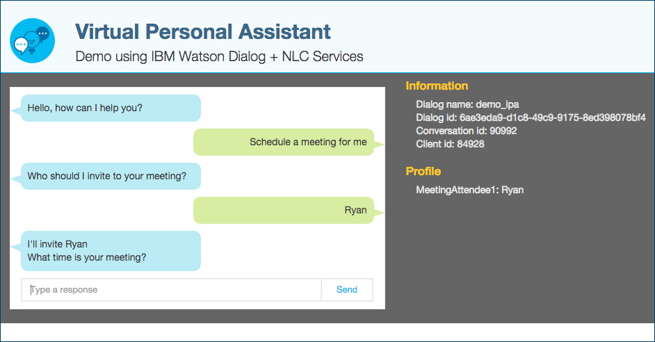
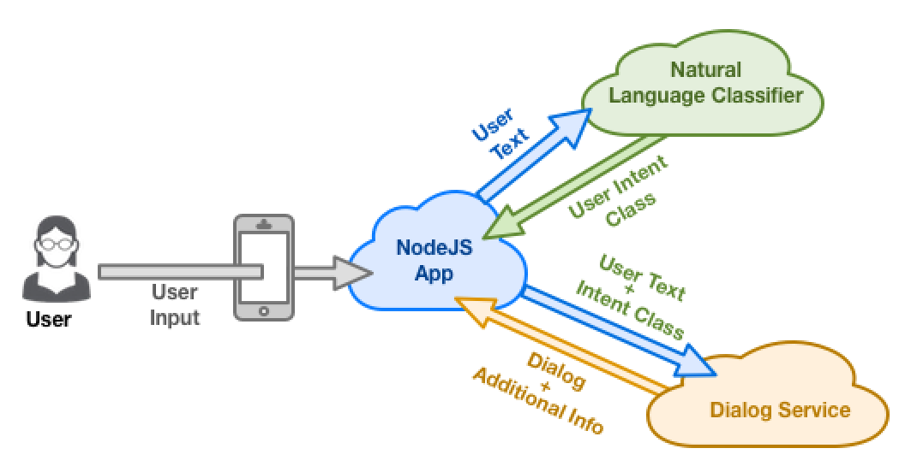

## Watson Intelligent Personal Assistant (Web Demo)

Check out the [working demo](http://ipa-demo-anthony.mybluemix.net/).

An [intelligent personal assistant](https://en.wikipedia.org/wiki/Intelligent_personal_assistant) is a software agent that can perform tasks or services for an individual.  In this demo, we'll combine two Watson services to illustrate the basics of intelligent task performance:
A. Capture user input.
B. Classify this input into one of several supported tasks
C. Ask users for any additional information required to complete the task
D. Execute the task for the user (an exercise left for you to complete)

To act on our user's intent, we first classify it into one our predefined classifications.  To accomplish this, we'll train the [Watson Natural Language Classifier service](https://www.ibm.com/smarterplanet/us/en/ibmwatson/developercloud/doc/nl-classifier/) using various text examples of users making the requests.  The NLC uses deep machine learning techniques to return the top predicted classes.

Next, we need any related information required to complete the user's request.  To do this, we'll rely on the [Watson Dialog service](http://www.ibm.com/smarterplanet/us/en/ibmwatson/developercloud/dialog.html) which supports building conversations between a user and an application. The Dialog service will track and store information obtained during the conversation until we have all the info required to complete the task. 

These are the user intents we'll attempt to classify:
* Schedule a meeting
* Send an email
* Ask to perform a numeric calculations
* Request a joke

#### Getting Started
Follow these sections to setup your services and host your app either in Bluemix or locally.
- [ ] [Step 1: Setup Watson Natural Language Classifier and Dialog services on Bluemix](https://github.com/biosopher/watson-ipa-web-nodejs/wiki/Setup-Watson-Natural-Language-Classifier-and-Dialog-services-on-Bluemix)
- [ ] [Step 2: Train the Natural Language Classifier service](https://github.com/biosopher/watson-ipa-web-nodejs/wiki/Train-the-Natural-Language-Classifier-service)
- [ ] [Step 3: Configure your Dialog service with IBM's Dialog XML](https://github.com/biosopher/watson-ipa-web-nodejs/wiki/Configure-your-Dialog-service-with-IBM's-Dialog-XML)
- [ ] [Step 4: Push app to Bluemix](https://github.com/biosopher/watson-ipa-web-nodejs/wiki/Push-App-to-Bluemix) 
- [ ] [Step 5 (optional): Running the app locally at http://localhost:300](https://github.com/biosopher/watson-ipa-web-nodejs/wiki/Running-Locally)
- [ ] [Step 6: Additional exercises for you to improve the app's functionality](https://github.com/biosopher/watson-ipa-web-nodejs/wiki/Exercises-for-you-to-complete)

#### How Does the Demo Work
Curious to know how the user text is classified to a specific intent and then mapped to a dialog flow?  Here's a brief overview of [how the Watson IPA Demo works?](https://github.com/biosopher/watson-ipa-web-nodejs/wiki/How-Does-the-Watson-IPA-Demo-Work).

#### Supporting Sections
* [Obtaining Service Credentials from the Command Line](https://github.com/biosopher/watson-ipa-web-nodejs/wiki/Obtaining-Service-Credentials-from-the-Command-Line)
* [Troubleshooting](https://github.com/biosopher/watson-ipa-web-nodejs/wiki/Troubleshooting)

#### More Details
For more details about developing applications that use Watson Developer Cloud services in Bluemix, see [Getting started with Watson Developer Cloud and Bluemix](http://www.ibm.com/smarterplanet/us/en/ibmwatson/developercloud/doc/getting_started/).

#### License
This sample code is licensed under Apache 2.0. Full license text is available in [LICENSE](https://github.com/watson-developer-cloud/natural-language-classifier-nodejs/blob/master/LICENSE).
This sample uses [jquery](https://jquery.com/) which is MIT license.

#### Disclaimer
The techniques and code shared are my own and don't necessarily represent IBM's position, strategies or opinions. Anyone is free to use, copy, distribute, modify or sell the source code and other materials shown in this video and it is provided "as is" without warranties. I am not responsible for any harm or damage caused to your computer, software or anything else caused by this material.
